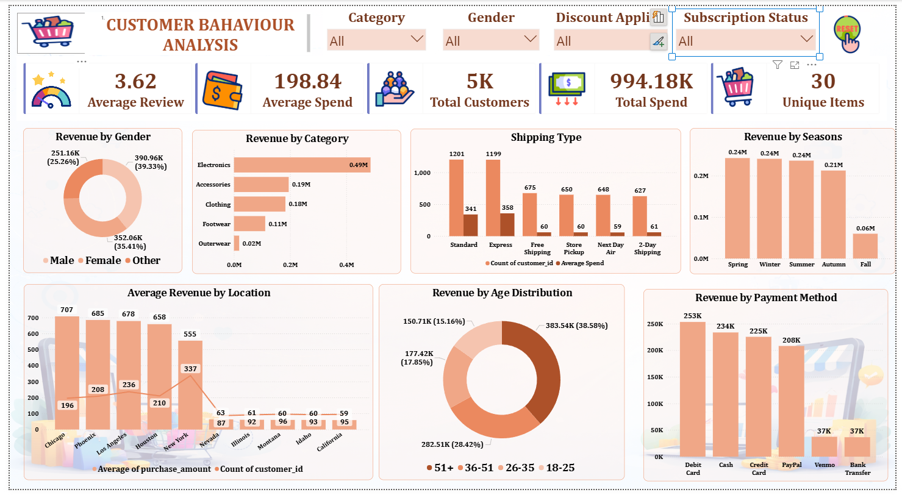
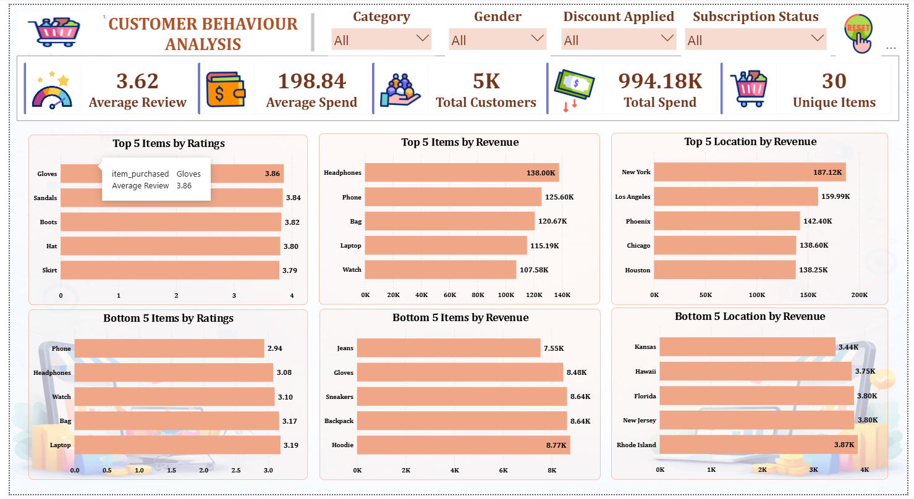

# E-Commerce Customer Behavior & Retail Analytics Pipeline

## 📌 Project Overview

This project delivers a comprehensive, end-to-end data analytics and engineering workflow optimizing raw e-commerce transactional data. The pipeline spans programmatic data engineering and exploratory data analysis (EDA) in Python, advanced relational database migration via MySQL, and an executive-ready interactive reporting framework built using Power BI.

The primary business objective is to handle data quality anomalies, decode consumer purchasing patterns, isolate performance extrema, and deliver actionable logistical and operational strategies.

---

## ⚙️ Data Engineering & Quality Pipeline

### 1. Initial Data Quality Issues Identified (Notebook 1: EDA)

During the initial exploratory data analysis phase, several structural anomalies were identified and documented:

- **Missing Values:** Detected and flagged across critical features: `Purchase Amount (USD)`, `Size`, `Review Rating`, and `Previous Purchases`.
- **Structural Duplicates:** Duplicate Customer IDs were observed across transactional records.
- **Inconsistent Categorization:** Certain products appeared under unexpected retail categories, indicating category mapping friction.
- **Schema Non-Standardization:** Raw column names lacked a standard convention, requiring normalization before database ingestion.

### 2. Preprocessing & Database Integration (Notebook 2: Cleaning)

The data quality anomalies were programmatically resolved using a dedicated Python pipeline:

- **Missing Data & Duplicates:** Handled missing rows across target columns and verified duplicate customer records to ensure absolute data integrity.
- **Schema Normalization:** Standardized all raw headers into clean, uniform `lowercase_and_underscores` (snake_case) formats.
- **Categorical Integrity:** Corrected inconsistent category mappings and improved sizing consistency across distinct product lines.
- **MySQL Migration:** The fully cleaned and structured dataset was exported directly into a local MySQL relational database. The table schemas and data ingestion pipeline were verified programmatically utilizing the `SQLAlchemy Inspector` engine.

---

## 📈 Deep-Dive Business Case Study & Insights (Notebook 3 & SQL)

### 1. Retail Product Performance Extrema

- **Revenue Powerhouses:** **Headphones ($138K)** and **Phones ($125.6K)** drive the highest absolute financial volume for the business, serving as core revenue anchors.
- **Quality Leaders:** **Gloves (3.86/5)** and **Sandals (3.84/5)** hold the highest customer satisfaction scores, making them premium candidates for targeted marketing bundles.
- **Underperformers:** **Outerwear** sits at the absolute bottom, generating a negligible **$20K** in total revenue.
- **Category Drivers:** Clothing and Accessories categories generate the vast majority of total sales revenue.

### 2. Customer Demographics & Behavioral Segmentation

- **The Core Demographic:** The **36-50 age bracket** is the absolute financial engine of this business, contributing **40.17% ($399.35K)** of total spend.
- **Gender Distribution:** Spending is relatively balanced but led by **Females (39.33%)**, closely followed by **Other (35.41%)** and **Males (25.26%)**.
- **Friction Points:** **Debit Cards ($253K)** and **Cash ($234K)** dominate transactions. **Venmo ($37K)** and **Bank Transfers ($37K)** lag drastically, indicating potential friction points in the digital checkout experience.
- **Loyalty Dynamics:** A small, high-frequency customer segment contributes a disproportionate amount of revenue, highlighting strong customer retention potential.

### 3. Logistical & Shipping Optimization

- **Volume Dominance:** **Standard Shipping (1,201 orders)** and **Express Shipping (1,199 orders)** handle the vast majority of logistical traffic.
- **Value Generation:** While Express and Standard capture the highest order counts, average purchase amounts remain stable, proving that customers utilize premium shipping for both high and low-value carts alike.

---

## 📊 Interactive Dashboard Interface

The analytical interface utilizes a highly polished, unified design framework featuring an interactive **"Reset All Filters" custom workflow tool** linked through Power BI bookmark engines to preserve visual configurations.

### Page 1: Customer Overview & Demographics

_Zooms into demographic segmentations, age distributions (programmatically binned into custom brackets), shipping layout efficiency, and localized purchasing behaviors._

### Page 2: Performance Leaderboards & Rankings

_A strict, comparative operational diagnostic interface capturing performance extrema across items, categories, and regional revenue metrics._

---

## 🚀 Strategic Business Recommendations

1. **Maximize Customer Lifetime Value (LTV):** Focus aggressive retention and loyalty strategies on repeat customers with high previous purchase counts to lock in long-term growth.
2. **Promotional Calibration:** Apply targeted, personalized discount strategies for slow-moving products (like Outerwear) since data reveals specific items rely heavily on promotional offers to convert sales.
3. **Inventory Agility:** Align product inventory and supply chain thresholds strictly with identified seasonal purchasing trends to minimize warehousing overhead.
4. **Checkout Optimization:** Review digital checkout workflows for payment methods like Venmo and Bank Transfers to reduce transaction friction and capture missing revenue.

---

## 🛠️ Tech Stack & Tools Used

- **Data Ingestion & Engineering:** Python (`pandas`, `numpy`)
- **Exploratory Data Analysis (EDA):** Jupyter Notebooks (`matplotlib`, `seaborn`)
- **Relational Database Management:** MySQL / SQL (Standardized using `lowercase_and_underscores`)
- **Business Intelligence & Data Visualization:** Power BI Desktop (Advanced multi-row grid design, custom icon frameworks, fully responsive bookmark states)
